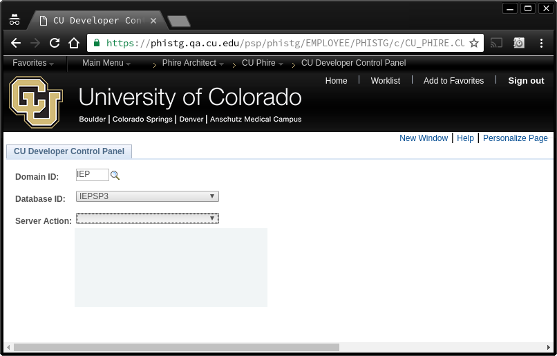

<!SLIDE subsection>
# Self Service
* At CU
  * Automic (formerly UC4, AppWorx)
  * Phire (Custom Component)
* Alternatives
  * Any other Scheduler
  * Custom component in any PeopleSoft Instance

<!SLIDE>
#Phire
##Application Change Management Tool

<!SLIDE>
#Automic
##Workload Automation
